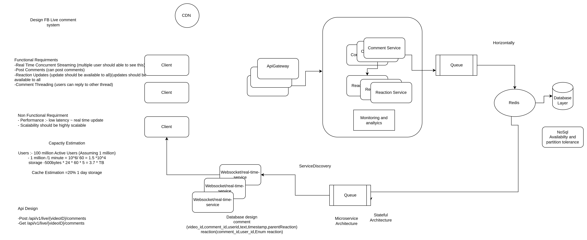

### Design FB Live Comment System

**Functional Requirements:**
1. **Real-time comment streaming:** Users should be able to see new comments as they are posted without refreshing the page.
2. **Post comments:** Users can post text-based comments while watching a live video.
3. **Reaction updates:** Each comment can receive reactions (like, love, etc.), and these reactions should update in real-time.
4. **Spam prevention and moderation tools:** There should be mechanisms to prevent spamming, allow moderation, and filter inappropriate comments.
5. **Comment threading:** Users can reply to other comments, creating threads.
6. **Load balancing for high traffic:** Must handle spikes in traffic, especially during popular live events.

Let me know when you're ready for the next part on Non-Functional Requirements.

**Non-Functional Requirements:**

1. **Performance:** The system must provide low-latency real-time updates, ideally within milliseconds of a comment being posted.
2. **Scalability:** Must scale horizontally to support millions of concurrent users, especially during peak events like celebrity live streams.
3. **Reliability:** Comments and reactions must not be lost, even under high loads. There should be fault tolerance to ensure continuous service.
4. **Consistency vs Availability:** Eventual consistency is acceptable for reactions, but comments should appear consistently in real-time for all users.
5. **Security:** Protect the system from spam, abuse, and unauthorized access, including rate limiting, captcha, and IP blocking for spammy behavior.
6. **Durability:** Comments and their associated data (reactions, timestamps) should be stored durably for post-event viewing.
7. **Availability:** System uptime should be close to 100%, especially during live events.

Let me know when you're ready to move to **Capacity Estimation**.


**Capacity Estimation:**

1. **Users:** Estimate the number of concurrent users during peak events (e.g., 10 million).
2. **Comments per second:** Assume a high traffic scenario where users generate 1 million comments per minute, translating to ~16,666 comments per second.
3. **Reactions per second:** If reactions (likes, loves) are 10x more frequent than comments, expect ~166,000 reactions per second.
4. **Data storage:**
   - **Comment size:** Each comment (with metadata like userID, timestamp, text, and reactions) is approximately 500 bytes.
   - **Reactions size:** Each reaction is about 100 bytes.
   - **Storage needs:** For an hour-long event, we might generate 1 million comments (500 MB) and 10 million reactions (1 GB).
5. **Bandwidth:** Must support real-time data transmission, assuming at least 1 MB per second per 1,000 active users, scaling up to terabytes during large events.
6. **Cache needs:** Frequently accessed comments and reactions (for real-time updates) should be cached. This could require several gigabytes of in-memory cache depending on event size.

Let me know when you're ready to move to **API Design**.


**API Design:**

1. **Post a comment (POST /live/{videoID}/comments):**
   - **Request:** 
     - Body: `{ "userID": "1234", "commentText": "This is awesome!" }`
     - Headers: Authentication token (OAuth/JWT)
   - **Response:** 
     - `{ "commentID": "5678", "status": "success", "timestamp": "2024-09-26T12:34:56Z" }`
     - HTTP 201 on success, HTTP 400 for invalid input.
   
2. **Fetch comments (GET /live/{videoID}/comments):**
   - **Request:** 
     - Query params: `?since=timestamp` to get only new comments.
   - **Response:** 
     - `[{ "commentID": "5678", "userID": "1234", "commentText": "This is awesome!", "timestamp": "2024-09-26T12:34:56Z", "reactions": { "likes": 10, "loves": 3 } }]`
   
3. **Post a reaction (POST /live/{videoID}/comments/{commentID}/reactions):**
   - **Request:** 
     - Body: `{ "reactionType": "like", "userID": "1234" }`
   - **Response:** 
     - `{ "status": "success", "reactionCount": { "likes": 11, "loves": 3 } }`
   
4. **Stream live comments (WebSocket or Server-Sent Events):**
   - **Endpoint:** `/live/{videoID}/comments/stream`
   - **Real-time updates:** Server pushes new comments or reactions to connected clients.

5. **Moderation API (DELETE /live/{videoID}/comments/{commentID}):**
   - **Request:** 
     - Headers: Admin authentication token.
   - **Response:** 
     - `{ "status": "deleted", "commentID": "5678" }`

Let me know when you're ready to move to **Database Design**.


**Database Design:**

1. **Type of Database:** A combination of SQL and NoSQL databases is recommended.
   - **SQL (e.g., PostgreSQL, MySQL):** Used for storing structured data like user profiles, comment metadata (userID, commentID, timestamp, videoID).
   - **NoSQL (e.g., Cassandra, MongoDB):** Used for fast writes and real-time read access for high-velocity data like comments and reactions.
   - **In-memory Database (e.g., Redis):** For caching frequently accessed data (hot comments, reactions) and handling live comment streaming.

2. **Schema Design (for SQL database):**
   - **Comments Table:**
     ```sql
     CREATE TABLE Comments (
       commentID VARCHAR(36) PRIMARY KEY,
       videoID VARCHAR(36),
       userID VARCHAR(36),
       commentText TEXT,
       timestamp TIMESTAMP,
       replyToCommentID VARCHAR(36), -- For threading
       INDEX (videoID, timestamp)
     );
     ```
   - **Reactions Table:**
     ```sql
     CREATE TABLE Reactions (
       reactionID VARCHAR(36) PRIMARY KEY,
       commentID VARCHAR(36),
       userID VARCHAR(36),
       reactionType VARCHAR(10), -- e.g., 'like', 'love'
       timestamp TIMESTAMP,
       INDEX (commentID, reactionType)
     );
     ```

3. **Sharding and Partitioning (for NoSQL):**
   - **Sharding by videoID:** Distribute comments based on the videoID to ensure horizontal scalability.
   - **Time-based partitioning:** For comments and reactions, partitioning based on timestamp will ensure better retrieval for active live events.

4. **Indexes:**
   - **Primary Indexes:** On `commentID` for fast retrieval of specific comments.
   - **Secondary Indexes:** On `videoID` and `timestamp` for fetching all comments in real-time for a specific live video.

5. **Replication and Durability:**
   - Enable replication to ensure data redundancy and prevent data loss during node failures.
   - Use write-ahead logging (WAL) or eventual consistency in NoSQL to handle high write-throughput.

Let me know when you're ready to move to **High-level Design**.


**High-level Design:**

1. **Client (User Interface):**
   - Users watching the live video will see real-time comments and reactions.
   - WebSockets or Server-Sent Events (SSE) are used to push new comments to clients in real-time.

2. **API Gateway:**
   - Receives all client requests (comments, reactions) and forwards them to the appropriate services.
   - Handles authentication, rate limiting, and routing.

3. **Comment Service:**
   - Responsible for processing and storing new comments.
   - Ensures the comment is persisted in the database (SQL/NoSQL), and then triggers real-time broadcast to all connected users.
   - Reads frequently accessed comments from a cache (Redis).

4. **Reaction Service:**
   - Handles reaction updates for each comment.
   - Updates the reaction count in real-time and pushes updates to the clients.

5. **WebSocket/Real-time Service:**
   - Manages real-time connections for millions of users.
   - Uses a scalable WebSocket cluster to broadcast new comments and reactions to connected clients.

6. **Moderation Service:**
   - Provides tools for admins to delete inappropriate comments.
   - Can throttle users who violate commenting guidelines.

7. **Database Layer:**
   - **SQL database** for structured data (e.g., comment metadata).
   - **NoSQL database** for high-throughput reads and writes of comments and reactions.
   - **Redis cache** for hot data storage (frequently accessed comments).

8. **Load Balancer:**
   - Distributes client requests evenly across multiple instances of the API Gateway, Comment Service, and WebSocket Service to ensure reliability and scalability.

9. **Monitoring and Analytics:**
   - Tracks the number of comments, reactions, and any performance issues in real-time.
   - Alerts are triggered in case of latency spikes or downtime.

Let me know when you're ready to move to **Request Flows**.


**Request Flows:**

1. **Post a Comment:**
   - **Step 1:** A user submits a comment via the client UI (web or mobile).
   - **Step 2:** The comment is sent to the **API Gateway**, which validates the request (authentication, rate limiting).
   - **Step 3:** The **Comment Service** processes the request, generates a unique comment ID, and stores the comment in the NoSQL database (or SQL if needed).
   - **Step 4:** The **WebSocket Service** pushes the new comment to all connected users watching the live stream in real-time.
   - **Step 5:** The comment is also cached in **Redis** for quick retrieval by other clients.
   
2. **Fetch Comments (on page load or refresh):**
   - **Step 1:** The client requests the latest comments from the **API Gateway** using a `GET /comments` call.
   - **Step 2:** The **API Gateway** forwards the request to the **Comment Service**, which queries the database (SQL/NoSQL) for the latest comments.
   - **Step 3:** Cached comments from **Redis** are served to reduce database load for frequently accessed comments.
   - **Step 4:** The server responds with a list of comments, which are then displayed in the UI.

3. **Post a Reaction:**
   - **Step 1:** A user reacts to a comment, sending the reaction request to the **API Gateway**.
   - **Step 2:** The **Reaction Service** receives the request, updates the reactions for the specific comment in the database, and caches the updated count.
   - **Step 3:** The **WebSocket Service** broadcasts the updated reaction count to all users watching the video.

4. **Moderation (Admin Deletes a Comment):**
   - **Step 1:** An admin sends a delete request via the moderation UI.
   - **Step 2:** The **Moderation Service** processes the request and deletes the comment from the database.
   - **Step 3:** A message is broadcast via the **WebSocket Service** to remove the comment from all connected users' interfaces.

Let me know when you're ready to move to **Detailed Component Design**.


**Detailed Component Design:**

1. **API Gateway:**
   - **Responsibilities:** Acts as a centralized entry point for all requests (comments, reactions, fetch data). It handles tasks like request validation, authentication, rate limiting, and routing requests to backend services.
   - **Tech Stack:** NGINX, AWS API Gateway, or custom-built solution with Node.js/Express.

2. **Comment Service:**
   - **Responsibilities:** Manages creating, reading, and caching comments. It validates and stores comments in the NoSQL/SQL database and caches frequently accessed comments.
   - **Components:**
     - **Comment Validator:** Checks the validity of the comment (e.g., length, profanity).
     - **Comment Processor:** Generates a unique comment ID, saves the comment in the database, and sends it to WebSocket for real-time broadcast.
     - **Cache Layer:** Uses Redis for caching hot comments.
   - **Tech Stack:** Node.js/Java, NoSQL (Cassandra), Redis for caching.

3. **Reaction Service:**
   - **Responsibilities:** Processes user reactions (like, love, etc.) on comments and ensures reaction counts are updated in real-time.
   - **Components:**
     - **Reaction Processor:** Increments reaction counters in the database and updates caches.
     - **Real-Time Notifier:** Broadcasts reaction updates to all connected users via WebSocket.
   - **Tech Stack:** Java, Redis, NoSQL, Kafka (for reaction streams).

4. **WebSocket/Real-time Service:**
   - **Responsibilities:** Manages real-time connections and broadcasts updates (new comments, reactions) to clients in real-time.
   - **Components:**
     - **Connection Manager:** Handles WebSocket connections, ensuring they are distributed across multiple servers.
     - **Message Broker:** Broadcasts real-time updates to connected clients.
   - **Tech Stack:** WebSockets or Server-Sent Events (SSE), Redis Pub/Sub or Kafka for message broadcasting.

5. **Moderation Service:**
   - **Responsibilities:** Enables admins to remove inappropriate comments or throttle misbehaving users.
   - **Components:**
     - **Admin Interface:** A web dashboard where admins can monitor and manage comments in real-time.
     - **Comment Removal:** Deletes comments from the database and broadcasts the deletion to all clients.
   - **Tech Stack:** Node.js, SQL for user and admin data.

6. **Databases:**
   - **NoSQL Database (Cassandra):** Stores comments with high throughput for writes and reads.
   - **SQL Database (PostgreSQL/MySQL):** Stores structured data, such as user profiles and comment metadata.
   - **Redis Cache:** Stores hot comments and reaction counts to reduce database load and improve response times.

7. **Load Balancer:**
   - **Responsibilities:** Distributes incoming traffic evenly across instances of the API Gateway and services to ensure reliability and scalability.
   - **Tech Stack:** NGINX, AWS Elastic Load Balancer, or similar.

Let me know when you're ready to move to **Trade-offs/Tech Choices**.


**Trade-offs/Tech Choices:**

1. **SQL vs NoSQL:**
   - **Trade-off:** 
     - **SQL** (e.g., PostgreSQL) provides strong consistency and structured queries, useful for metadata and user information. 
     - **NoSQL** (e.g., Cassandra) offers better scalability and handles high write throughput, making it ideal for real-time comments and reactions.
   - **Choice:** Use **NoSQL** for comments and reactions due to high write/read needs and **SQL** for metadata to maintain data structure and relations.

2. **WebSockets vs Server-Sent Events (SSE):**
   - **Trade-off:** 
     - **WebSockets** offer full-duplex communication, allowing real-time, two-way updates but are more complex to scale. 
     - **SSE** is simpler and works well for one-way updates but is not suitable for two-way communication.
   - **Choice:** **WebSockets** for two-way real-time communication (comments, reactions) due to the need for both sending and receiving messages.

3. **Caching (Redis) vs Direct Database Reads:**
   - **Trade-off:** 
     - **Redis** caching provides very fast access to frequently accessed data but introduces complexity in cache invalidation.
     - Direct database reads ensure data is always fresh but might lead to performance bottlenecks with high loads.
   - **Choice:** **Redis** for caching hot comments and reactions, with a careful invalidation strategy to ensure data freshness.

4. **Eventual Consistency vs Strong Consistency:**
   - **Trade-off:** 
     - **Eventual consistency** allows better scalability and performance but may lead to stale data during short periods.
     - **Strong consistency** ensures immediate accuracy but might slow down system performance under heavy load.
   - **Choice:** **Eventual consistency** for reactions and real-time updates, where slight delays are acceptable. **Strong consistency** for comment posting to ensure it shows up for all users immediately.

5. **Horizontal Scaling vs Vertical Scaling:**
   - **Trade-off:** 
     - **Vertical scaling** involves adding more resources (CPU, RAM) to a single machine, which has hard limits.
     - **Horizontal scaling** involves distributing the load across multiple servers, making it more cost-effective and scalable.
   - **Choice:** **Horizontal scaling** across multiple instances for both WebSocket servers and databases to handle millions of users.

6. **Monolithic vs Microservices Architecture:**
   - **Trade-off:** 
     - A **monolithic architecture** is simpler to develop and deploy but harder to scale.
     - **Microservices architecture** provides better scalability and flexibility but increases complexity in communication and data consistency.
   - **Choice:** **Microservices** for scalability and to independently handle components like comment processing, reactions, and real-time notifications.

Let me know when you're ready to move to **Failure Scenarios/Bottlenecks**.

